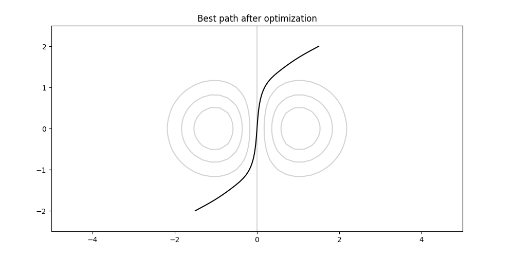

# SurfOpt

Experiments with gradient descent based path planning on differentiable
surfaces.

## Intro

### Algorithm description
The algorithm works by first selecting one or several initial paths. These are
sets of consecutive points on a given differentiable surface with common start
and end points. After this the points of the initial path(s) are moved by
gradient descent towards path(s) with smaller segment lengths between
consecutive points. This single optimization step is repeated several times.
Finally, if there were more than one initial paths chosen in the beginning then
the shortest of them is selected after the final optimization step.

This approach is quite sensitive to initial conditions (shapes of the surface
and the initial path(s)). For this reason sampling of various initial paths and
regularization is needed. Here the regularization is an added loss term which
measures the mean of squared differences between segment lengths of the
consecutive points and the mean of these lengths.

The algorithm works best in fairly flat surfaces. This project is meant for
experimenting when and how it fails and how to counter these situations.
For this reason the included surface configurations have steep hills and valleys.

### Surface configurations
The surfaces are created by reading their configuration from a JSON-file and
then constructing the corresponding function. These functions are either sums of
gaussian functions which have been multiplied by positive or negative constants,
or polynomials, or sums of these two type of functions.

## Installation

Clone this repository and install the libraries with pip:

```
git clone https://github.com/JussiM01/SurfOpt
cd SurfOpt/
pip install -r requirements.txt
```

## How to use

### Basic use
For running the program with the default set of parameters and configuration
file (later defines the surface function), use the following command:
```
python3 surfopt
```
### Changing the start and end points
The start and end point of the paths can be changed with the args ```-x0```
(or ```--start_x```), ```-y0``` (or ```--start_y```), ```-x1``` (or ```--end_x```)
and ```-y1``` (or ```--end_y```) as follows:
```
python3 surfopt -x0 <x0> -y0 <y0> -x1 <x1> -y1 <y1>
```
where ```<x0>``` and ```<y0>``` are the float values of the starting point
and ```<x1>```and ```<y1>``` are similar values for the end point.

The default values for these are: ```-1.5```, ```-2.0```, ```1.5``` and ```2.0```.

### Changing the surface
The surface configuration can be switched with the arg ```-f``` (or ```--conf_file```)
by using:
```
python3 surfopt -f <filename>
```
where ```<filename>``` is the name of the config-file without the file
extension. These files can be found from the directory ```surfopt/config_files```.

The default filename is ```gauss_updown```.

### Viewing the surfaces
It's also possible to view a surface with the arg ```-v``` (or ```--view_surface```)
by using:
```
python3 surfopt -v -f <filename>
```
where ```<filename>``` is name of the file without the file extension.

Example of two surfaces:

<p align="middle">
  
  
</p>

It's possible to choose a different color scheme from matplotlib's color maps
with then arg ```-cm``` (or ```--cmap```). For example:
```
python3 surfopt -v -f <filename> -cm inferno
```
will make the plot using matplotlib's inferno color map. For reversing the
order use ```_r``` postfix in the color map's name. For example:
```
python3 surfopt -v -f <filename> -cm inferno_r
```
will make the plot using matplotlib's reversed inferno color map.

Examples of these:

<p align="middle">
  
  
</p>

### Changing the hyper parameters
The hyper parameters for the optimization are: learning rate, number of
optimization steps, amount of regularization and optimizer type.
Command line args for these are: ```-l``` (or ```--learning_rate```), ```-no```
(or ```--num_opt_steps```), ```-re``` (or ```--regular_const```) and ```-o```
(or ```--optim_type```).

Out of these the first and third should be small floats, the second should be
int and the fourth should be one of ```SGD```, ```Adam```, ```AdamW```.

The default values are: ```5e-4```, ```1000```, ```1e-3``` and ```SGD```.

Example of how to use:
```
python3 surfopt -l 1e-5
```
will change the learning rate value to 1e-5.

### Changing the sampling methods
The optimization uses sampled paths which are modified during the optimization.
Most of the sampling methods are non-random (full sample from a determined set).

The sampling options that can be used either separately or simultaneously.
The default options is to sample only one a straight line segment that connects
the start point to the end point. This option can be turned off by ```-ul False```
(or ```--use_line False```).

Other options are:

- Arc sampling ```-ua``` (or ```--use_args```) which selects curved arcs between
the end points.

  Sub-parameters for this are: ```-na``` (or ```--num_angles```), ```-mi```
  (or ```--min_angle```) and ```-ma``` (or ```--max_angle```). The first one
  should be an int, the second one float (a fraction of pi) and same holds also
  for the third sub-parameter. The default values for these
  are: ```1```, ```0.17453292519943295``` and ```0.7853981633974483```; where
  the second last number is an approximate value of pi/18 and the last number is
  an approximate value of pi/4.

  Description: The first value ```<num angles>``` will set the number of arcs
  symmetrically below and above the line that connects the start and end points.
  Namely, ```<num angles> + 1``` for both. The second value ```<min angle>```
  is the angle between the flattest arcs (above and below) and the connecting
  line at the start point. The third value ```<min angle>``` is the same but for
  the for the most curved arcs (above and below).

- Sine sampling ```-us``` (or ```--use_sines```) which selects
sine curves between the end points.

  Sub-parameters for this are: ```-c``` (or ```--constants```) and ```-m```
  (or ```--multiples```), The first one should be a string of comma separated
  floats and the second a string of comma separated ints. Their default values
  are: ```1.0,1.0,1.0``` and ```1,-1```.

  Description: The first first string value ```<constants>``` gives the values
  of the constants by which each sine is multiplied. Their multiplicities (the
  value times 2pi) are given by the second string value ```<multiples>```.

  Example:
  ```
  python surfopt -us -c 1.0,2.0 -m 3,4
  ```
  will sample sine terms ```1.0*sin(3*2pi*x)``` and ```2.0*sin(4*2pi*x)```.

- Sine sums sampling ```-uss```
(or ```--use_sines_sums```) which selects sums of sine curves between the end
points. This is the only method which uses random sampling.

  Sub-parameters for this are: ```-m``` (or ```--multiples```), ```-u```
  (or ```--up_ranges```), ```-nsa``` and (or ```--num_samples```), The first
  one should be a string of comma separated floats, the second one string of
  comma separated ints and third should be an int. Their default values
  are: ```1,-1```, ```1.0,1.0,1.0``` and ```10```.

  Optionally also a random seed ```-r``` (or ```--random_seed```) can be used.
  This should be an int.

  Description: The first string value ```<multiples>``` tells the multiplicities
  of the each sine tern sampled for the sum. The second string value ```<up ranges>```
  tells the uper bounds of the ranges where their constants are sampled form (the
  lower bound is zero for all of them). The last int term tells how many sine sums
  will be sampled.

  Example:
  ```
  python surfopt -us -m 1,-1,2 -u 1.0,2.0,3.0 -nsa 3
  ```
  samples tree sine sums of the form: ```a*sin(1*2pi*x) + b*sin(-1*2pi*x) + c*sin(2*2pi*x)```
  where ```a``` is between 0.0 and 1.0, ```b``` is between 0.0 and 2.0, and ```c```
  is between 0.0 and 3.0.

Common parameter for all these options is ```-ns``` (or ```--num_steps```)
which is an int. For this parameter the default value is ```50```. This tells
how many points there will be in the each sampled path.

File for the sampler has a ```if __name__ == '__main__'``` section for testing
its functionality through visualizations. It's possible to experiment with it
as follows:
```
cd surfopt
python3 -m src.sampler <args and values>
```
where ```<args and values>``` are the command line args and their values.

Examples of the different sampling methods:

<p align="middle">
  
  
  
  
</p>

(line sampling, arc sampling, sine sampling and sine sums sampling).

### Using saved parameters (points, surface, sampling & hyper parameters)
Changing of the default values might cause the algorithm to fail. For reference
there are also saved parameter files available. These contain configurations
for a surface, hyper parameters, sampling and end points for which the
optimization works reasonably well. To run the optimization with saved
parameters use:
```
python3 surfopt -pf <filename>
```
where ```<filename>``` is the name of the parameter file which are located at
the directory ```surfopt/saved_params```. Each file name contains the name of
the surface it uses.

### Plotting
There are several plotting options. Its possible to plot the changes which
happened during the optimization in each path with the command line
arg ```-pc``` (or ```--plot_changes```). For loss development use ```-pr```
(or ```--plot_results```). These are are ```store_true``` args and hence don't
need any boolean value after them.

The path which is best performing after the optimization is plotted by default.
This behavior can be switched off with ```-pb False```
(or ```--plot_best False```).

For plotting all the above choices use
```
python3 surfopt -pa
```
(or ```--plot_all```) which is ```store_true``` option and dosen't need
any boolean value.

Examples of the  plots:

<p align="middle">
  
  
  
</p>

The first plot is the changes plot which is plotted separately for every path.
It shows the changes during the optimization. The yellow path is the initial
path and the colors get cooler and darker for later optimizations steps. If the
path diverge badly (with NaN values) it's possible that it dosen't appear in the
plot.

The second plot is the results plot which show the losses during the optimization
for all paths and their mean loss. The legend for color codes is only shown when
there is at most 10 paths. If some of the paths diverge badly (with NaN values)
it's possible that these don't appear in the plot.

The last plot shows the best trajectory after the optimization. Again, if there
is bad divergence the plot might not show any path. The points of the best path
are also printed by default. This behavior can be switched of by setting the
arg ```-prb``` (or ```--print_best```) to ```False```.

If there are several plots chosen the next plot is always shown only after the
previous plot has been closed, which can be done by pressing ```q``` on the
keyboard or by clicking the ```X``` on the plot window.

### Saving the parameters
```
python3 surfopt <args and values> -sp -sn <name for the params file>
```
where ```<args and values>``` are the other command line args and their values.
For example:
```
python3 surfopt -l 1e-5 -sp -sn new_lr
```
this will save otherwise default configuration except with given learning rate,
to ```surfopt/saved_params``` directory as a file ```new_lr.json```.

Optionally, this can be also done without giving any name for the file:
```
python3 surfopt <args and values> -sp
```
This selects the file name according to current time. In both cases, if the plot
saving option is used, the plots are saved to folder ```surfopt/plots/<name>```
where ```<name>``` is the name given after ```-sn``` arg or time based name
in the other case.

### Creating random surfaces
It's possible create random surfaces. These are made of gaussian bump functions.
Same number of randomly selected positive (hills) and negative (valleys)
bump functions are added together to create a surface.

For making one with the default parameters and a random seed use:
```
python3 surfopt -c -r <seed value>
```
(or use ```--create_surface``` and ```--random_seed```) where ```<seed value>```
is the int value of the seed.

For varying the number of gaussians (the same number will be used for both the
positive and the negative bumps) use ```-ng``` (or ```--num_gauss```). However,
it should be noted that the more there are bumps the slower the optimization
will take.

The bottom range for the random values of the diagonal terms of the covariance
matrices is set with ```-d0``` (or ```--diag_min```). Maximum of this range
is set with ```-d1``` (or ```--diag_max```).

Similar values for the off-diagonal terms are set with ```-o0```
(or ```--offd_min```) and  ```-o1``` (or ```--offd_max```).

In the both scales the min values should be positive and less than the max
values.

The means of the gaussian function are sampled from the same ranges that are
used for creating a grid for plots. These ranges can be changed with ```-xmi```
(or ```--x_min```), ``` -xma``` (or ```--x_max```), ```-xmi``` (or ```--x_min```)
and ```--xma``` (or ```--x_max```).

Finally, the scale parameter can be used for multiplying all functions with it.
This way the height range of the surface can be altered. For this use ```-sc```
(or ```-scale```).

The created surfaces are saved to directory ```surfopt/config_files```
with names of the form ```gauss<N>seed<M>.json``` where ```<N>``` is the value
chosen for the number of gaussians and ```<M>``` is the value of the random
seed (for conciseness the scale parameter is not used).

Example:
```
python3 surfopt -c -r 0 -ng 5
```
This creates a surface with 5 randomly selected positive and negative gaussian
bump functions (whose terms are sampled from the default ranges) and saves it
with the name ```gauss5seed0.json```.

Examples of two random surfaces:

<p align="middle">
  
  
</p>

### Testing
There are unit tests for the ```surfacemap.py``` file. These can be run as follows:
```
cd surfopt
python3 -m pytest
```

## Convergence properties
The optimizer type seems to matter. Although ```Adam``` and ```AdamW``` seem to
converge faster and be less prone to divergence they also seem to converge
towards unnatural looking paths, at least in some cases. Thus ```SGD```seems to
be better choice for this algorithm.

Sampling of several paths is needed since it's possible that some paths converge
very well and some start to diverge very badly even when they share the same
boundary points and the same hyper-parameters are used for their optimization.

The regularization makes the convergence slightly more unstable, but without it
the algorithm is able to make short cuts. That is, the points can get cluttered
near the boundary of a hill or a valley acting as if there would be one long
segment passing through or above it.
